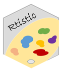

# Rtistic 

## Introduction

The goal of `Rtistic` is to provide an easy 'hackathon-in-a-box' activity groups of R users. Users can collaborate to create a collection of custom themes for `ggplot2`, RMarkddown HTML documents, and `xaringan`.

The focus of Rtistic is to provide the basic outline for an R package that can be forked and used for the 'infrastructure' of a styling and theming package developed in a group setting. A lot of the boilerplate RMarkdown and `ggplot2` code is already written, so participants can focus on the fun and creative process of picking colors, fonts, spacing, etc. 

While `Rtistic` is intended to be fun and light-hearted. It also has real benefits for team building and training, including:

- Learning more about `ggplot2` and RMarkdown customization options
- Writing `roxygen2`-style documentation
- Looking under the hood at the structure of an R package
- Working collaboratively through GitHub (with branches, PRs, etc.)

Of course, depending on how much time you want to spend on this activity and where you want to focus (e.g. learning `ggplot2` options versus learning basic CSS for RMarkdown), any number of the parts can be scaled back. For example:

- Only build either `ggplot2` or RMarkdown themes instead of both
- Have participant share just a single `R` file instead of working with a package structure (e.g. )
- Allow participants to email / upload their output somewhere else and not worry about making a PR

Tactically, this may work the best if individuals break off into small groups to work on separate themes. Ideas of prompts could be each team creates their own theme for:

- A monochromatic theme for each color of the rainbow
- A character on a TV show
- A season of the year

## Contents

### The Workhorse

`R/palette-infrastructure.R` contains all of the fuctions that users will ultimately call to apply the different palettes. This should be left as-is except for renaming all the functions from `*_rtistic` to whatever is desirable. Specifically, it defines the following scales:

- `scale_(color/colour/fill)_discrete_rtistic(palette = "test", extend = FALSE)`
- `scale_(color/colour/fill)_opinionated_rtistic(palette = "test")`
- `scale_(color/colour/fill)_continuous_rtistic(palette = "test")`
- `scale_(color/colour/fill)_diverging_rtistic(palette = "test", midpoint = 5)`

Additionally, to help keep track of all of the community-contributed themes, it provides the `get_rtistic_palettes()` function which prints out a characted vector of the names of available palettes (based on scanning the package namespace for objects ending in "`_pal`")

### Scratchpad Files for Experimentation

The following files are available in the `scratchpad/` directory to help with the design process by quickly iterating on style choices:

- `rmd-theme-demo.Rmd`: An RMarkdown document with an in-line CSS chunk. Ultimately, CSS will be moved to a separate file for your final theme package, but having it embedded in the document allows for fast and transparent iteration to see the effects of different options
- `gg-theme-demo.Rmd`: An RMarkdown document with dummy data and `ggplot2` with a lot of theme options. The current ggplot is pretty ugly, but this is an attempt to provide a near one-stop-shop overview into `ggplot2` theme options that participants can manipulate

### Boilerplate Code to Edit

Boilerplate package code exists in the `R/` and `inst/` directories:

- `gg-palette-test.R`: Defines colors of choice and uses them to create discrete (fixed number, interpolated, and opinionated) and continuous (monotonic and diverging) color palettes
- `gg-theme-test.R`: Defines theme function for custom `ggplot2`s
- `rmd-html-test.R`: Defines render function for custom RMarkdown themes. This depends upon:
  + `inst/rmarkdown/resources/html-styles-test.css`: Custom CSS to style RMarkdown
  + `inst/rmarkdown/resources/favicon.png`: Custom favicon for document
  + `inst/rmarkdown/resources/logo-test.png`: Custom logo for document footer
- `rmd-slides-test.R`: Defines render function for custom `xaringan` themes. This depends upon:
  + `inst/rmarkdown/resouces/slide-styles-test.css`: Custom CSS to style slides

Boilerplate code also exists in the `vignettes/` directory:

- `gg-palette-test.Rmd`: contains an array of basic plots to demonstrate the new palette and scales created
- `gg-theme-test.Rmd`: demonstrates the effect of a custom theme on a plot, optionally paired with any of the custom palettes

These are the files that participants should ultimately save under new names, edit, and PR back to the package. Other files should not be edited.

## High-Level Process

**Admin Instructions**:

*Initial Set Up - Template Approach*

- Generate your own repo from this template by clicking the green "Use Template" button above (next to the "Clone / Download" button) or by going to [this link](https://github.com/emilyriederer/Rtistic/generate)
- Clone the repo to your computer (`git clone {put HTTPS URL here}`)
- Replace all mentions of the package name (`Rtistic`) to your desired package name
  + If you're using RStudio, you can find all mentions of the name with `Ctrl+Shift+F`
  + Be sure to use the `available` package to make sure your name does not conflict with an existing package
- Help teams keep their work clean and modular and review PRs carefully as they come in
- As a finals step, consider making a basic `pkgdown` site with all of the themes. Vignettes created by individual teams will beome articles to display all of the different new palettes and themes as a "gallery". (For help *also* customizing this, you'll find a template style sheet and config file in the `pkgdown/` directory. Contents should be organized reasonably (e.g. like functions and vignettes grouped together) if teams follow appropriate naming conventions.)

*Initial Set Up - Forking Approach*

- Fork this repo to your account
- Clone the repo to your computer (`git clone {put HTTPS URL here}`)
- Replace all mentions of the package name (`Rtistic`) to your desired package name
  + If you're using RStudio, you can find all mentions of the name with `Ctrl+Shift+F`
  + Be sure to use the `available` package to make sure your name does not conflict with an existing package
- Create a new repo for your hackathon package and repoint your local repo to it (`git remote set-url origin {put HTTPS URL here}`)

*Ongoing Process*

- Help teams keep their work clean and modular and review PRs carefully as they come in
- As a finals step, consider making a basic `pkgdown` site with all of the themes. Vignettes created by individual teams will beome articles to display all of the different new themes as a "gallery". (For help *also* customizing this, you'll find a template style sheet in `pkgdown/extra.css`)

**Participant / Team Instructions**:

- Fork the repo (on GitHub) created by the admin
- Clone the repo to your computer (`git clone {put HTTPS URL here}`)
- Create a new branch to work in (`git checkout -b my-new-theme` will create a branch called `my-new-theme`)
- Play in the `scratchpad/` directory to determine CSS and `ggplot2` options that you like
- Review the files in the `R/` and `inst/` folders and migrate your options accordingly
- Commit regularly as you make changes with informative messages (`git commit -m "{describe what you changed}"`)
- When you're ready to submit, push back to your github branch (`git push origin my-new-theme` - or whatever your branch is called)
- On GitHub, create a pull request with yor changes back to the main repo

## Detailed Instructions for Participants

### ggplot Palette Instructions

#### Defining the palette

- Make a copy of the `R/gg-palette-test.R` file in the same folder. Rename it as `gg-palette-{theme}.R` where `{theme}` represents something descriptive about your theme.
- Change the definitions of the variables `test_pal`, `test_pal_cont`, and `test_pal_div` and rename the `test` prefix to something appropriate (probably the `{theme}` stub)
- Update the documentation to describe your palette
- Save your file and run it locallly

#### Documenting the palette

- Make a copy of the `vignettes/gg-palette-test` in the same folder. Rename it as `gg-palette-{theme}.Rmd`
- Since vignettes serve as long-form documentation, add some descriptive text about what this palette is meant to represent
- Change references to the test palette throughout and point them to your newly-defined palette
- Run the vignette chunks interactively to view your palettes. Iterate between this file and the R script defining the palettes until you are happy with the results.
- Be sure to change any boilerplat text and update the vignette's title in the YAML header

### ggplot Theme Instructions

#### Defining the theme

- Check out existing themes linked in the Resources section below for inspiration (and reuse!)
- Open up the `scratchpad/gg-theme-demo.Rmd` file and play around with the supplied theme to understand the options
- Iterate until you like the settings you have made. `ggplot2` has very nice defaults, so don't feel obligated to make major -- or any -- changes if you don't want to.
- Make a copy of the `R/gg-theme-test.R` file in the same folder. Rename it as `gg-theme-{theme}.R`
- Change the name of the function being defined to `theme_{theme}`
- Move the code you created in the RMarkdown into the function definition 
- Update the documentation to describe your theme
- Save your file and run it locally

#### Documenting the theme

- Make a copy of the `vignettes/gg-theme-test` in the same folder. Rename it as `gg-theme-{theme}.Rmd`
- Since vignettes serve as long-form documentation, add some descriptive text about what motivated this theme
- Change the code to call your theme instead of using `+  theme_test()` 
- Be sure to change any boilerplat text and update the vignette's title in the YAML header

### RMarkdown HTML Theme Instructions

#### Defining CSS for your theme

- Check out existing themes linked in the Resources section below for inspiration (and reuse!)
- Open up the `scratchpad/rmd-theme-demo.Rmd` file and play around with the supplied CSS to understand the options
- Iterate until you like the settings you have made. Like `ggplot2`, RMarkdown has very nice defaults, so don't feel obligated to make major -- or any -- changes if you don't want to.
- Make a copy of the `inst/rmarkdown/resources/html-styles-test.css` file in the same folder. Rename it as `html-styles-{theme}.css`. Move your CSS code from the scratchpad into this file

#### Defining your HTML theme

- Make a copy of the `R/rmd-html-test.R` file in the same folder. Rename it as `rmd-html-{theme}.R`
- Change the name of the function being defined to `html_{theme}`
- Edit the lines of code that provide the filepath for `css` and `footer` to the files you have defined
- Pull up the documentation for `rmarkdown::html_document()`, learn about the other parameters you can pass in, and decide if there are any other changes that you want to make
- Update the documentation to describe your theme

#### Adding a favicon to your theme

Favicons are the small icon that show up in the browser tab for a website or other HTML document.

- Find an image you wish to use for your favicon. Small, square images of type `png`, `gif`, or `ico` work the best.
- Save this image as `favicon.png` in `inst/rmarkdown/resources`. You will have to delete the image that is currently there (the `Rtistic` logo).
- Open the R script that defines your HTML theme. If you followed the instructions about, it should be named `rmd-html-{theme}.R`
- Find the section of your theme which begins `## TODO FAVICON`
- Follow the instructions commented in that section. In summary:
  + Uncomment the boilerplate code that writes an HTML header pointing to your favicon
  + Add `in_header = favicon_file` inside of `includes = rmarkdown::includes()`
  
### Adding a footer to your theme

- Examine the section of the boilerplate theme which begins `## TODO: FOOTER`. This dynamically generates a footer and saves it to a temp file.
- If you wish to include an image in your footer, save this image as `logo-{theme}.png` in `inst/rmarkdown/resources` and change the line `footer_logo <- pkg_resource('rmarkdown/resources/logo-test.png')` to reference your new image file
- The subsequent lines of code generate HTML for name, contact information, and timestamp. You may edit these in many different ways:
  + Add or remove lines with additional standard information
  + Parameterize some of this information in your function so users can dynamically change the stated name/email, chose whether to include a timestamp or not, etc.
  + Add `after_body = footer_file` inside of `include = rmarkdown::includes()`

### xaringan Theme Instructions

#### Defining CSS for your theme

- Check out existing themes linked in the Resources section below for inspiration and tips for writing `xaringan` CSS 
- Make a copy of the `inst/rmarkdown/resources/slide-styles-test.css` file in the same folder. Rename it as `slide-styles-{theme}.css`. Move your CSS code from the scratchpad into this file

#### Defining the theme

- Make a copy of the `R/rmd-slide-test.R` file in the same folder. Rename it as `rmd-slide-{theme}.R`
- Change the name of the function being defined to `slides_{theme}`
- Edit the lines of code that provide the filepath for `css` to the files you have defined
- Pull up the documentation for `xaringan::moon_reader()`, learn about the other parameters you can pass in, and decide if there are any other changes that you want to make
- Update the documentation to describe your theme

## Resources

### Core Learning Pre-Work

Understanding core R, `ggplot2`, and CSS concepts before the hackathon will make it easier to suceed.

- [Visualize Your Data primer on RStudio Cloud](https://rstudio.cloud/learn/primers/3): Starts with the basics of `ggplot2` and works its way up to a final section including plot customization. This will be useful for those wanting to create a new plot theme. The course does not have to be taken end-to-end, so those familiar with `ggplot2` can skip directly to the "Customization" section.
- [Basic CSS course from FreeCodeCamp](https://learn.freecodecamp.org/): Learn the basics of CSS will help participants understand what can be easily changed in an RMarkdown theme and how to do it.
- [Instructions for pull requests on GitHub](https://guides.github.com/activities/hello-world/): If you plan to use GitHub for team collaboration, this succinct overview explains how teams can submit their work through pull requests

### Brainstorming

Looking at existing themes can spark creativity. More tactically, one can also borrow from these themes in their own designs.

- [ggplot2 theme gallery](https://datascienceplus.com/ggplot2-themes-examples/): A preview of some common `ggplot2` themes. It also bears mention to participants that there are countless more themes in other projects and packages.
- [ggplot2 Replace Functionality](https://ggplot2.tidyverse.org/reference/theme_get.html): If you want to leave an existing theme almost completely in-tact, learn about the replace function to modify select components of a pre-existing theme.
- [RMarkdown theme gallery](http://www.datadreaming.org/post/r-markdown-theme-gallery/): As above, this blog demos a number of RMarkdown themes. Obviously, the collection is not comprehensive, but it gives a nice overview for context.

### Developer Utilities

- [Selector Gadget tool](https://cran.r-project.org/web/packages/rvest/vignettes/selectorgadget.html): This browser widget can help participants explore the structure of an RMarkdown HTML output and find the HTML tags they want to style.
- [Chrome Developer Tools](https://developers.google.com/web/tools/chrome-devtools/inspect-styles/): Similarly, most browsers have robust tools for inspecting a website's source code. These instructions explain how to use Chrome's version.

### xaringan Specific Utilities

There is particularly good support for building `xaringan` themes

- [`xaringan` wiki page](https://github.com/yihui/xaringan/wiki/Changing-fonts) describes different elements of the CSS and the relationship between different CSS files
- [`xaringanthemer` R package](https://pkg.garrickadenbuie.com/xaringanthemer/) provides a user-friendly R API for generating the CSS code you need. If this is more appealing than working in raw CSS, the package's `write_xaringan_theme()` function will convert your R code to CSS code that can be saved in this package. 

## Credits

Boilerplate RMarkdown code is largely inspired by [Michael Harper's repo](https://github.com/dr-harper/example-rmd-templates) as referenced in the book [RMarkdown: The Definitive Guide](https://bookdown.org/yihui/rmarkdown/).

Boilerplate code for `ggplot2` themes and palettes is inspired by Simon Jackson's [blog on corporate color palettes](https://drsimonj.svbtle.com/creating-corporate-colour-palettes-for-ggplot2), Florian Teschner's [code-through on creating a unicorn theme](https://www.r-bloggers.com/how-to-create-a-ggplot-theme-unicorn-edition/), and Garrick Aden-Buie's [`ggpomological` package](https://www.garrickadenbuie.com/project/ggpomological/)

